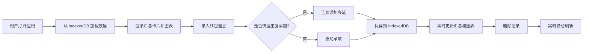

## 1. 产品概述

本产品是一款纯前端的压岁钱收支管理看板，帮助年轻人在春节期间管理红包收支记录。用户可手动录入每笔红包信息，系统自动汇总收支数据并通过可视化图表直观展示，解决「月底对账搞不清净赚还是净亏」的痛点。

- 目标用户：春节期间收发红包的年轻人
- 核心价值：清晰记录、实时汇总、直观可视化、本地离线可用

## 2. 核心功能

### 2.1 用户角色

| 角色 | 注册方式 | 核心权限 |
|------|----------|----------|
| 普通用户 | 无需注册，本地存储 | 录入、查看、删除红包记录，查看汇总统计和图表 |

### 2.2 功能模块

1. **首页看板**：收支汇总卡片、环形图、折线图、最近记录列表
2. **录入表单**：红包信息录入、快速重复添加功能
3. **数据持久化**：IndexedDB 本地存储最近 50 条记录

### 2.3 页面详情

| 页面名称 | 模块名称 | 功能描述 |
|----------|----------|----------|
| 首页看板 | 收支汇总卡片 | 展示总收入、总支出、净额三个核心指标 |
| 首页看板 | 环形图 | 展示各亲戚关系的收支占比 |
| 首页看板 | 折线图 | 展示除夕到初七每日收支波动趋势 |
| 首页看板 | 记录列表 | 展示最近录入的红包记录，支持删除 |
| 录入表单 | 红包录入 | 录入来源关系、金额、收/发类型、渠道、时间 |
| 录入表单 | 快速重复添加 | 支持一键添加多笔相同金额给不同人的红包 |

## 3. 核心流程

用户打开应用 → 查看历史记录和统计图表 → 录入新红包（支持快速重复添加）→ 实时更新汇总和图表 → 删除错误记录 → 数据自动保存到本地 → 刷新页面数据不丢失

## 4. 用户界面设计

### 4.1 设计风格

- **主色调**：喜庆的中国红 (#D72638) 搭配金色 (#F4D03F) 作为点缀，契合春节氛围
- **辅助色**：深灰 (#2C3E50) 用于文字，浅灰 (#ECF0F1) 用于背景
- **按钮风格**：圆角 8px，主按钮采用渐变红色，悬停有轻微上浮效果
- **字体**：标题使用「Noto Serif SC」衬线字体体现传统感，正文使用「Noto Sans SC」无衬线字体保证可读性
- **布局风格**：卡片式布局，带有柔和阴影，顶部导航栏，三栏式主内容区
- **图标风格**：使用春节元素图标（红包、灯笼、金币等），emoji 增强节日氛围

### 4.2 页面设计概述

| 页面名称 | 模块名称 | UI 元素 |
|----------|----------|---------|
| 首页看板 | 顶部导航 | 应用标题、春节装饰元素、当前日期 |
| 首页看板 | 汇总卡片区 | 三张卡片：总收入（绿色+红包图标）、总支出（红色+发送图标）、净额（金色+元宝图标） |
| 首页看板 | 图表区 | 左侧环形图（各亲戚占比）、右侧折线图（每日波动） |
| 首页看板 | 录入表单区 | 表单字段、快速添加按钮、提交按钮 |
| 首页看板 | 记录列表 | 表格展示，每行包含关系、金额、类型、渠道、时间、删除按钮 |

### 4.3 响应式

- 桌面端优先设计，适配 1920px 及以上
- 平板端：图表区改为上下布局
- 移动端：单列布局，表单字段简化，图表缩小
- 所有交互元素支持触摸操作

## 5. 非功能性需求

### 5.1 性能要求
- 页面加载时间 < 2s
- 图表渲染时间 < 500ms
- 数据增删后 UI 响应 < 100ms

### 5.2 数据持久化
- IndexedDB 存储最近 50 条记录
- 页面刷新后数据完整保留
- 超过 50 条自动删除最早记录

### 5.3 离线可用
- 纯前端应用，无网络依赖
- 所有数据本地存储
