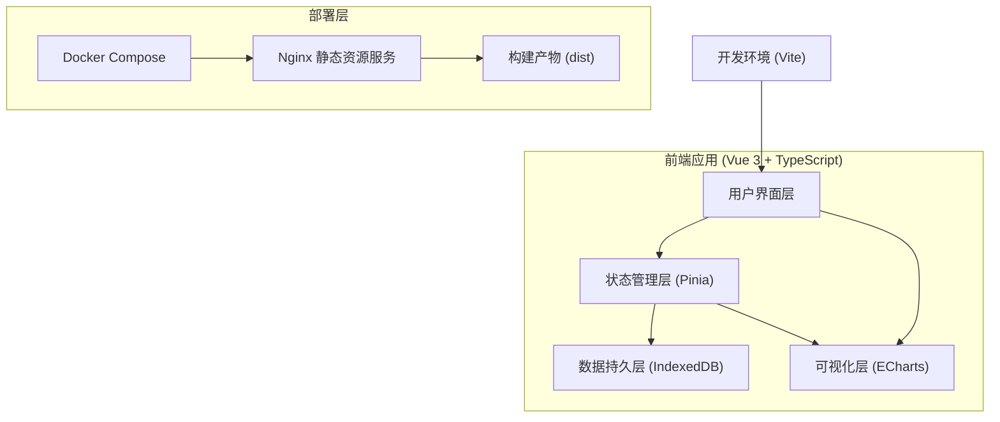
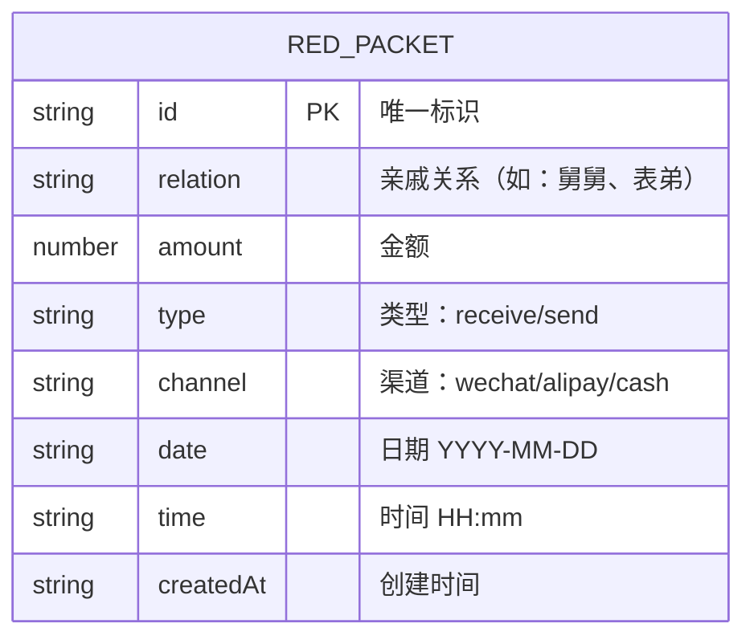

## 1. 架构设计



## 2. 技术描述

- **前端框架**: Vue 3.4.x + TypeScript 5.x
- **构建工具**: Vite 5.x
- **状态管理**: Pinia 2.x
- **可视化**: ECharts 5.x
- **样式**: Tailwind CSS 3.x
- **本地存储**: IndexedDB (idb 库封装)
- **部署**: Docker + Nginx

## 3. 项目目录结构

```
ljx-0293-1/
├── src/
│   ├── components/
│   │   ├── SummaryCards.vue      # 收支汇总卡片
│   │   ├── PieChart.vue          # 环形图组件
│   │   ├── LineChart.vue         # 折线图组件
│   │   ├── RedPacketForm.vue     # 录入表单
│   │   └── RecordList.vue        # 记录列表
│   ├── stores/
│   │   └── redPacket.ts          # Pinia store
│   ├── utils/
│   │   ├── idb.ts                # IndexedDB 封装
│   │   └── date.ts               # 日期工具函数
│   ├── types/
│   │   └── index.ts              # TypeScript 类型定义
│   ├── App.vue
│   └── main.ts
├── public/
│   └── sample-data.json          # 示例数据
├── docker/
│   └── nginx.conf                # Nginx 配置
├── docker-compose.yml
├── tailwind.config.js
├── tsconfig.json
├── vite.config.ts
└── README.md
```

## 4. 数据模型

### 4.1 数据模型定义



### 4.2 TypeScript 类型定义

```typescript
interface RedPacket {
  id: string;
  relation: string;
  amount: number;
  type: 'receive' | 'send';
  channel: 'wechat' | 'alipay' | 'cash';
  date: string;
  time: string;
  createdAt: string;
}

interface Summary {
  totalReceive: number;
  totalSend: number;
  netAmount: number;
}

interface RelationStat {
  name: string;
  value: number;
}

interface DailyStat {
  date: string;
  receive: number;
  send: number;
}
```

## 5. 状态管理 (Pinia)

```typescript
// stores/redPacket.ts
export const useRedPacketStore = defineStore('redPacket', {
  state: () => ({
    records: [] as RedPacket[],
    isLoading: false,
  }),
  
  getters: {
    summary: (state): Summary => {
      // 计算总收入、总支出、净额
    },
    relationStats: (state): RelationStat[] => {
      // 按亲戚关系汇总
    },
    dailyStats: (state): DailyStat[] => {
      // 按日期汇总（除夕到初七）
    },
  },
  
  actions: {
    async fetchRecords() {
      // 从 IndexedDB 加载数据
    },
    async addRecord(record: Omit<RedPacket, 'id' | 'createdAt'>) {
      // 添加单笔记录
    },
    async addRecords(records: Omit<RedPacket, 'id' | 'createdAt'>[]) {
      // 批量添加记录（快速重复添加）
    },
    async deleteRecord(id: string) {
      // 删除记录
    },
    async importData(records: RedPacket[]) {
      // 导入示例数据
    },
  },
});
```

## 6. IndexedDB 设计

- 数据库名: `redPacketDB`
- 版本: 1
- Object Store: `records`
- 索引: `date`, `createdAt`
- 容量限制: 最近 50 条记录

## 7. 部署配置

### 7.1 docker-compose.yml

```yaml
version: '3.8'
services:
  web:
    image: nginx:alpine
    ports:
      - "8080:80"
    volumes:
      - ./dist:/usr/share/nginx/html
      - ./docker/nginx.conf:/etc/nginx/conf.d/default.conf
    restart: unless-stopped
```

### 7.2 Nginx 配置

```nginx
server {
    listen 80;
    server_name localhost;
    root /usr/share/nginx/html;
    index index.html;

    location / {
        try_files $uri $uri/ /index.html;
    }

    location ~* \.(js|css|png|jpg|jpeg|gif|ico|svg|woff|woff2|ttf|eot)$ {
        expires 1y;
        add_header Cache-Control "public, immutable";
    }
}
```
